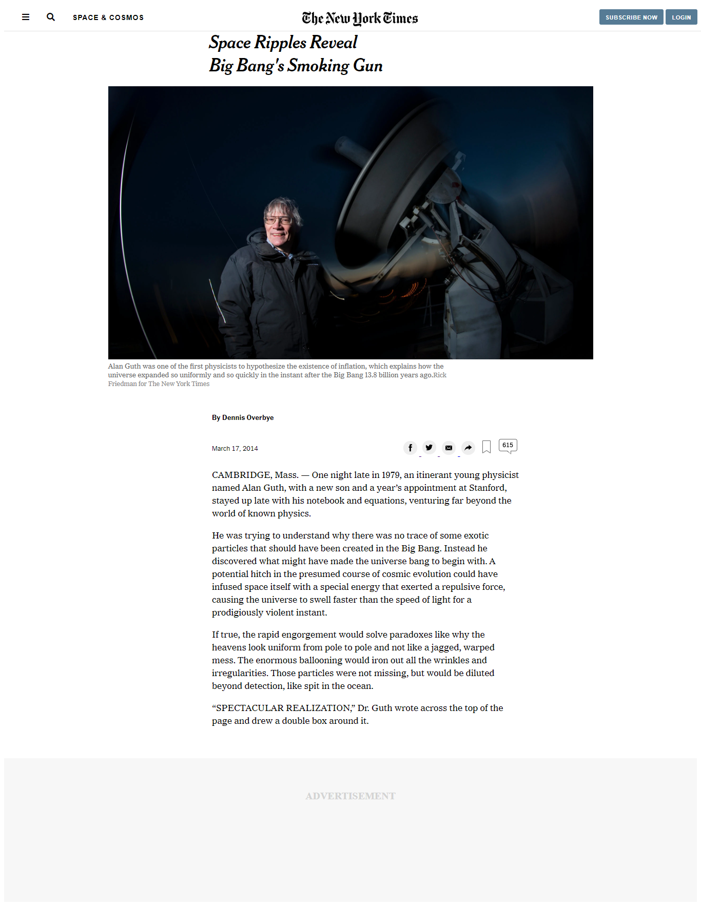

# New-York-Times

> This project is to clone The New York Times Article Page

> 

## Built With

- HTML &
- CSS

## Live Demo

[Live Demo Link](https://raw.githack.com/glowreeyah/New-York-Times-Clone/nyt-article/index.html)

## Getting Started

To get a local copy up and running follow these simple example steps.

### Prerequisites

A browser of your choice preferrably Chrome.

### Setup

Fork this project to your local machine

## Authors

👤 **Precious Udegbue**

- Github: [@evabanegacom](https://github.com/evabanegacom)

👤 **Glory David**

- Github: [@glowreeyah](https://github.com/glowreeyah)
- Twitter: [@gloweeeyah](https://twitter.com/gloweeeyah)
- Linkedin: [Glorydavid](https://linkedin.com/glory-david)

## 🤝 Contributing

Contributions, issues and feature requests are welcome!

Feel free to check the [https://github.com/glowreeyah/New-York-Times-Clone/issues](issues/).

## Show your support

Give a ⭐️ if you like this project!

## Acknowledgments

- Freecodecamp
- [W3-CSS-GRID](https://www.w3schools.com/howto/howto_css_image_text.asp)
- [The Skinny on CSS Attribute Selectors](https://css-tricks.com/attribute-selectors/)
- [Taming Advanced CSS Selectors](https://www.smashingmagazine.com/2009/08/taming-advanced-css-selectors/)
